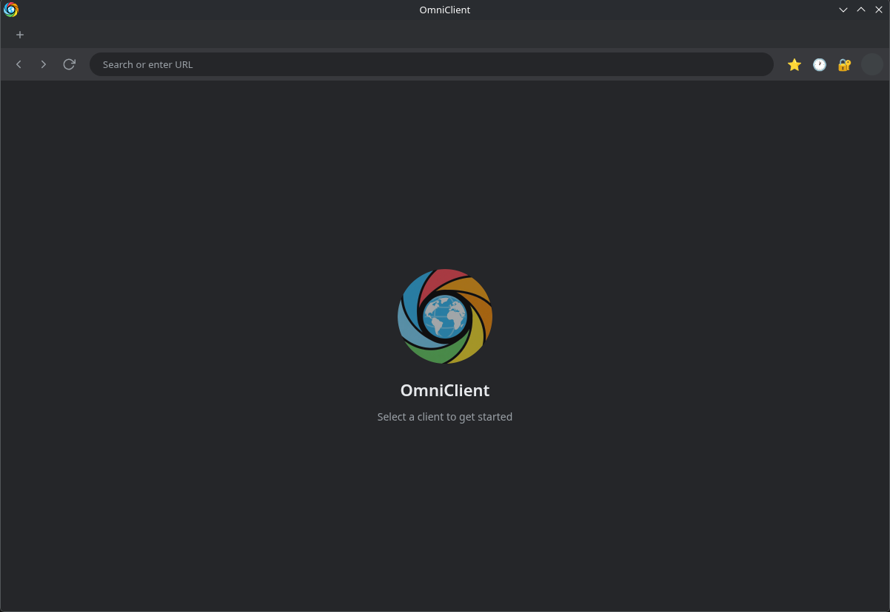
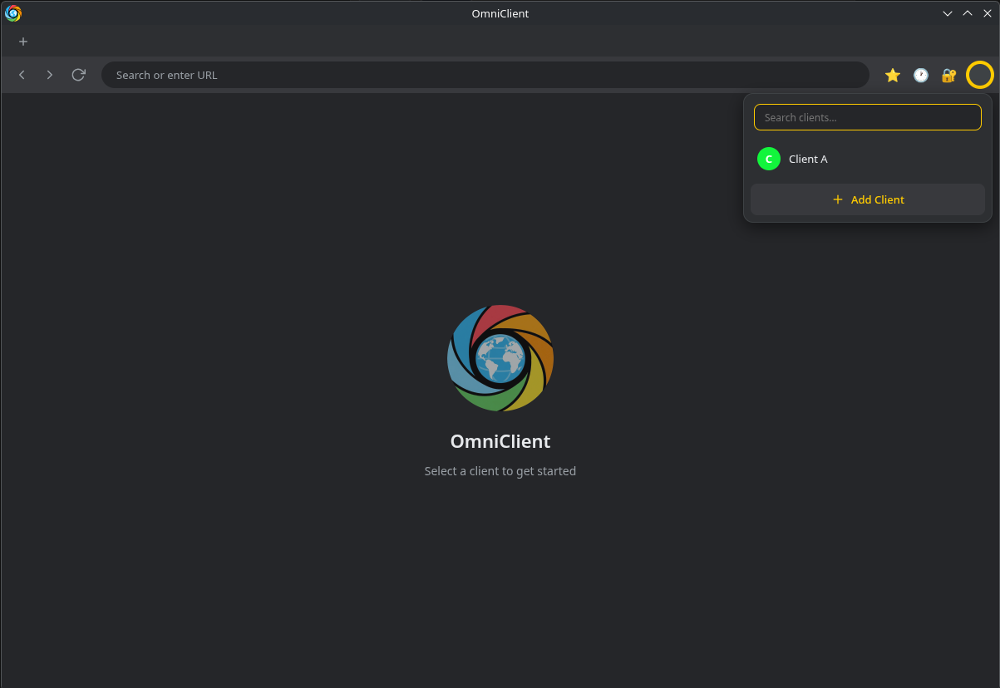
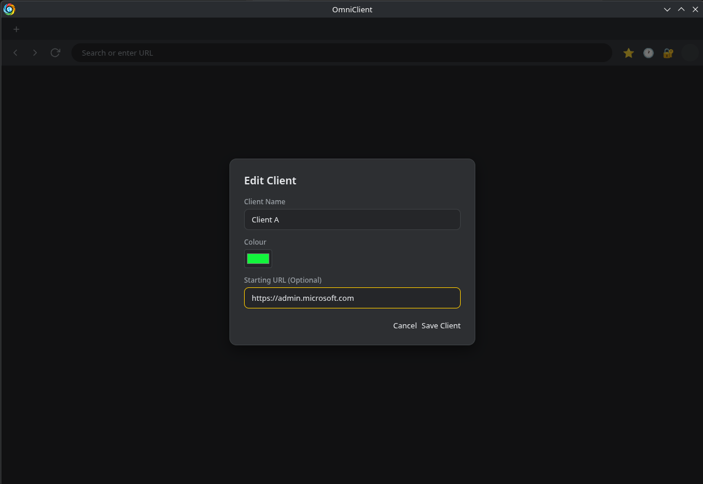
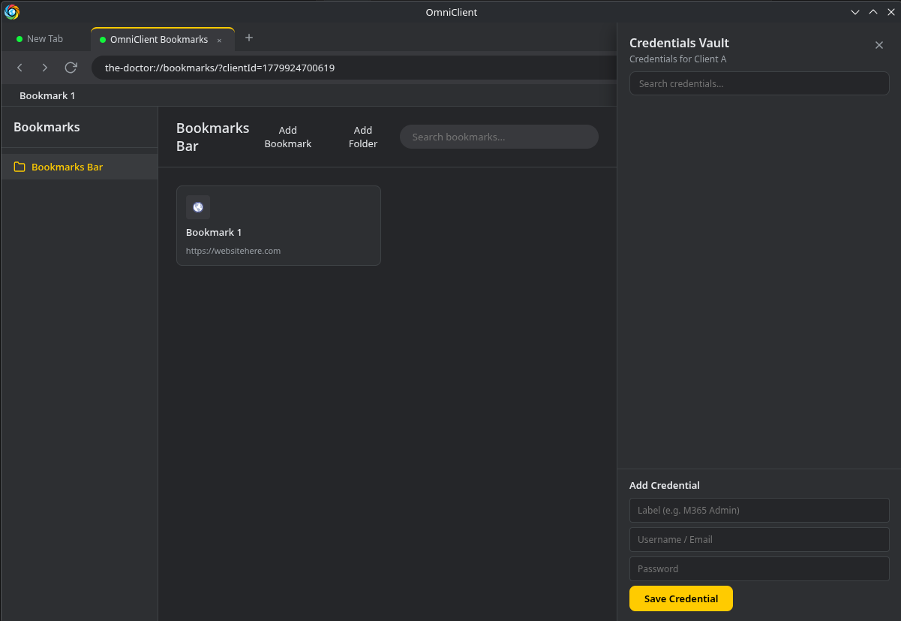
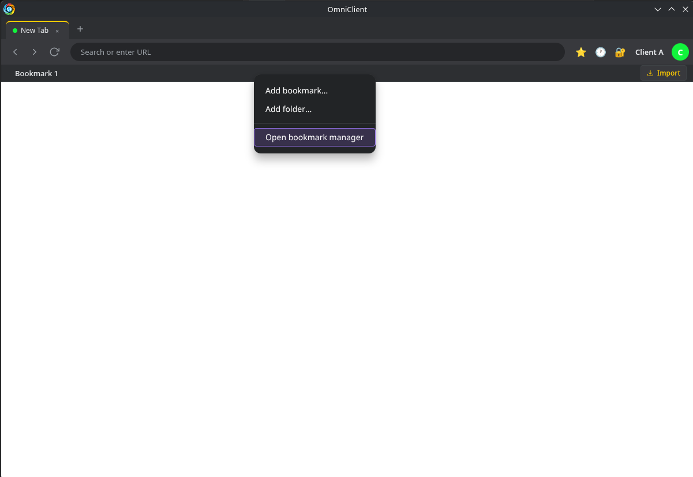
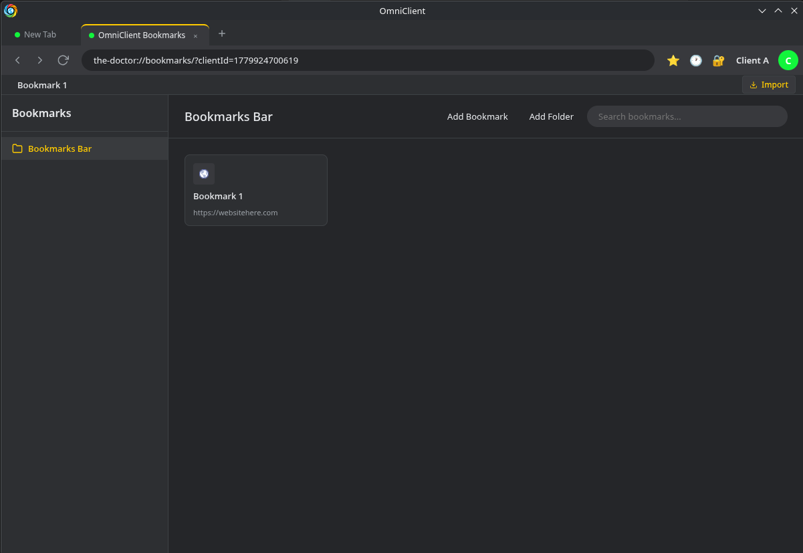
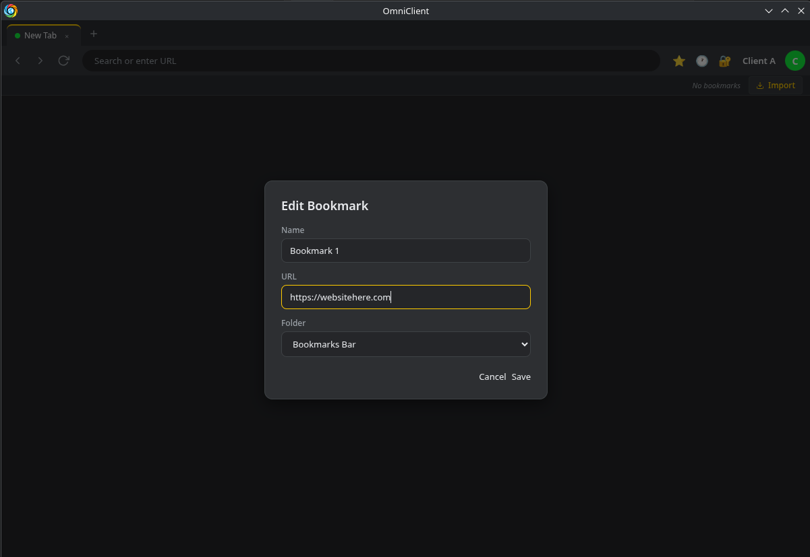

<p align="center">
  
</p>

<h1 align="center">OmniClient</h1>

<p align="center">
  <strong>The Ultimate Multi-Tenant Browser for MSPs & IT Support Engineers</strong>
</p>

<p align="center">
  
  
  
</p>

<hr>

OmniClient is a powerful, Chromium-based browser meticulously engineered for Level 1-3 IT Support Engineers and Managed Service Providers (MSPs). 

If you manage multiple Microsoft 365, Azure, Entra, or Intune environments simultaneously, you know the pain of constantly juggling incognito windows, clearing cookies, or accidentally applying changes to the wrong tenant. OmniClient solves this by providing **hardware-level partitioning for every single client you manage.**

## ✨ Core Features

* 🛡️ **Strict Session Isolation**: Every client profile you create operates in a completely sandboxed `WebContentsView` partition. Cookies, local storage, and cache are strictly isolated. You can have 10 tabs open across 10 different Microsoft 365 Admin Centers at the exact same time without them ever bleeding into one another.
* 👥 **Client Switching**: Seamlessly switch between client environments using the integrated avatar dropdown in the navigation bar. Your active tabs, browsing history, and Vault credentials immediately rotate to match the active client context.
* 🔐 **The Credential Vault**: An encrypted, built-in credential manager allowing you to securely save and auto-copy tenant passwords (AES-256-GCM encrypted) per client. Say goodbye to insecure plain-text password spreadsheets.
* 🔖 **Native Bookmark Management**: A fully integrated hierarchical bookmark system tailored for your tenant URLs. Create folders, manage nested links, drag-and-drop to reorganise, and access native context menus for lightning-fast navigation.
* 🎨 **Sleek, Dynamic Interface**: Built natively in Electron and JavaScript, the interface features a custom "glassmorphism" aesthetic, complete with dark mode, glowing accents, and smooth micro-animations.

## 🚀 Why OmniClient?

Working in IT support demands precision. OmniClient acts as your absolute command centre, giving you an all-encompassing, omnipotent view over your entire client roster from a single, unified interface.

## 🛠️ Building from Source

If you prefer not to use the pre-compiled AppImage, you can easily build OmniClient directly from the source code.

**Prerequisites:** Node.js (v18+) and npm (v9+)

```bash
# 1. Clone the repository
git clone https://github.com/brisbinchicken/omniclient.git
cd omniclient

# 2. Install dependencies
npm install

# 3. Run in development mode (hot-reload enabled)
npm start

# 4. Compile your own AppImage
npm run dist
```

*(For a deep dive into the architecture, IPC routes, and security model, check out the [BUILD-PACK.md](BUILD-PACK.md) included in this repository).*

## 📸 Screenshots

<p align="center">
  
  <br>
  <em>OmniClient Empty State Home Screen</em>
</p>

<p align="center">
  
  <br>
  <em>Seamlessly Switch Between Client Contexts</em>
</p>

<p align="center">
  
  <br>
  <em>Client Creation & Partitioning</em>
</p>

<p align="center">
  
  <br>
  <em>The Credential Vault</em>
</p>

<p align="center">
  
  <br>
  <em>Per-Client Bookmarks Bar</em>
</p>

<p align="center">
  
  <br>
  <em>Hierarchical Bookmark Manager</em>
</p>

<p align="center">
  
  <br>
  <em>Editing Bookmarks & Folders</em>
</p>

---

<p align="center">
  <i>Disclaimer: Antigravity was used to help during the creation process of this software.</i>
</p>
